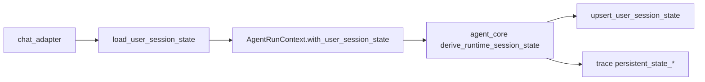
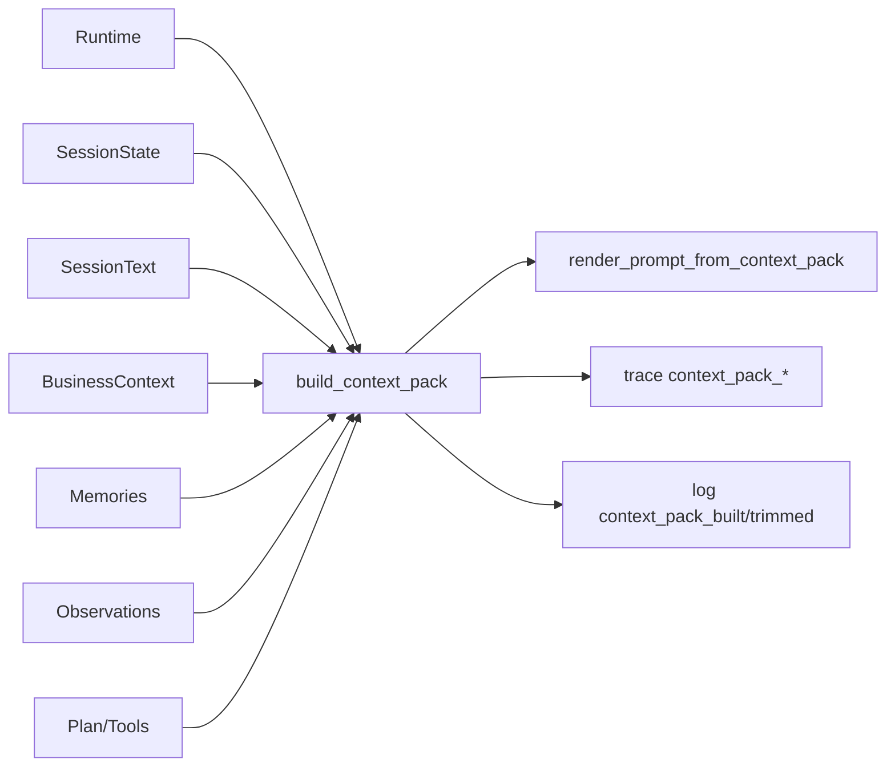

# Context 文章配图文案（2 张）

> 用途：给 Figma / draw.io / Excalidraw 直接画图用  
> 建议比例：16:9，深浅两套主题都可读

---

## 图 1：SessionState 接线图（先状态）

### 图标题

**AMClaw SessionState 接线：从聊天输入到状态回写**

### 图中模块与箭头

1. `chat_adapter`（消息入口）
   - 输入：用户消息 + session flush
2. `task_store.user_session_states`
   - 读取：`load_user_session_state(user_id)`
3. `AgentRunContext`
   - 注入：`with_user_session_state(...)`
4. `agent_core`
   - 使用：参与 `RuntimeSessionStateSnapshot` 推导
5. `task_store.user_session_states`
   - 回写：`upsert_user_session_state(...)`（最小回写）
6. `trace`
   - 输出：`persistent_state_present/source/updated`

### 图注（放图下）

这一步解决的是“当前任务状态表达”，不是长期知识召回。  
目标是让跨轮次目标、阻塞原因和下一步不再完全依赖当轮猜测。

---

## 图 2：ContextPack 组装图（再打包）

### 图标题

**AMClaw ContextPack：统一组装入口与可观测输出**

### 图中模块与箭头

左侧输入源（Sources）：

- Runtime Context
- Session State
- Session Text
- Business Context
- User Memories
- Latest/Previous Observations
- Runtime Plan
- Tool Descriptions

中间处理（Build）：

1. `build_context_pack`
2. Section policy（priority / max_chars / pinned_lines）
3. Trim/Drop（生成 `drop reasons`）

右侧输出（Outputs）：

- `render_prompt_from_context_pack`（给 LLM 的最终 prompt）
- Trace 字段：
  - `context_pack_present`
  - `context_pack_section_count`
  - `context_pack_total_chars`
  - `context_pack_drop_reasons`
- 日志事件：
  - `context_pack_built`
  - `context_pack_trimmed`

### 图注（放图下）

这一步解决的是“怎么喂给模型”的工程问题：  
把散落拼接改为单入口组装，让上下文来源、预算和裁剪理由都可解释。

---

## 可选：Mermaid 草图（内部预览）

